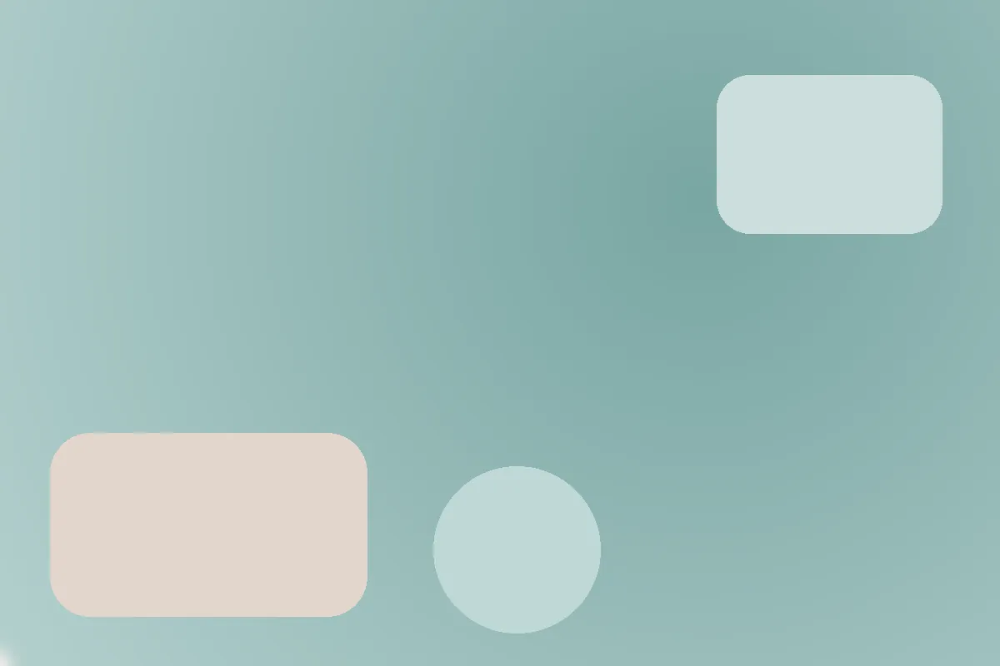
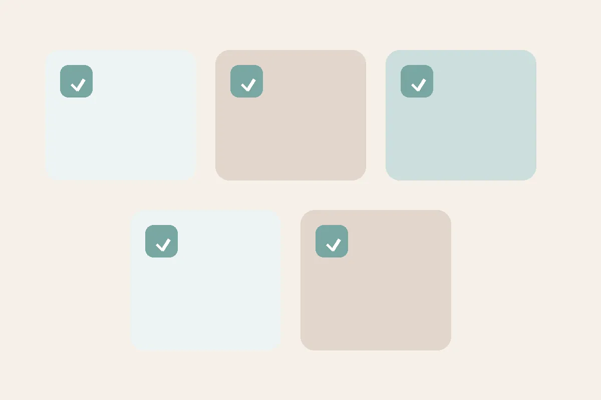

<!DOCTYPE html>
<html lang="pt-br">
<head>
  <meta charset="utf-8" />
  <meta name="viewport" content="width=device-width, initial-scale=1" />
  <title>Laura Sathler | Psicóloga (CRP 04/30866)</title>
  <meta name="description" content="Psicoterapia humanista-existencial 100% online para adolescentes e adultos. Ansiedade, vazio existencial, estresse e burnout. Agende sua sessão com Laura Sathler, CRP 04/30866." />
  <meta name="theme-color" content="#f6efe9" />
  <link rel="icon" type="image/webp" href="laura-avatar-512.webp" />
  
</head>
<body>
  <header>
    

      <nav aria-label="principal">
        <ul>
          <li><a href="#inicio">Início</a></li>
          <li><a href="#sobre">Sobre</a></li>
          <li><a href="#atendimento">Atendimento</a></li>
          <li><a href="#contato">Contato</a></li>
        </ul>
      </nav>
    

  </header>

  <main class="container">
    <!-- HERO -->
    <section id="inicio" class="hero">
      

        <h1>Psicoterapia humanista‑existencial · 100% online</h1>
        
Espaço de acolhimento, presença e reconexão com você. Atendo adolescentes e adultos com ética, sigilo e linguagem acessível.

        
<a href="https://wa.me/5531991593800" class="btn-primary" target="_blank" rel="noopener">Agendar sessão no WhatsApp</a>

      

      
    </section>

    <!-- SOBRE -->
    <section id="sobre" class="grid-2">
      

        
      

      

        <h2>Sobre mim</h2>
        
Sou <strong>Laura Sathler</strong>, psicóloga (CRP 04/30866) com <strong>mais de 10 anos de experiência clínica</strong>. Formada pela PUC Minas e com especialização em <strong>avaliação e diagnóstico psicológico</strong>, atuo com base na <strong>abordagem humanista‑existencial</strong>.

        
Atendo <strong>exclusivamente online</strong>, oferecendo um espaço seguro e acolhedor para lidar com <em>ansiedade</em>, <em>tristeza profunda</em>, <em>vazio existencial</em>, <em>estresse e burnout</em>, <em>autoestima</em> e <em>relacionamentos</em>.

        
Sessões de 50 minutos · Frequência geralmente semanal · Plataforma segura · Sigilo profissional.

      

    </section>

    <!-- ATENDIMENTO -->
    <section id="atendimento" class="grid-2" style="margin-top:2rem;">
      

        <h2>Áreas de atendimento</h2>
        
Ansiedade, vazio existencial, burnout, autoconhecimento, autoestima, luto e relacionamentos. Para <strong>adolescentes</strong> (a partir de 14 anos) e <strong>adultos</strong>.

        
Quando buscar terapia? Se você sente que vive no automático, convive com ansiedade ou está esgotada(o) pelo trabalho, a terapia pode ser o primeiro passo para reconectar-se a si mesma(o).

      

      
    </section>

    <!-- CONTATO -->
    <section id="contato" class="grid-2" style="margin-top:2rem;">
      

        <h2>Agende sua sessão</h2>
        

          <strong>WhatsApp:</strong> <a href="https://wa.me/5531991593800" target="_blank" rel="noopener">Enviar mensagem</a> 
          <strong>E‑mail:</strong> <a href="mailto:Laurasathler@yahoo.com.br">Laurasathler@yahoo.com.br</a> 
          <strong>Telefone:</strong> +55 31 99159‑3800
        

        
Ao entrar em contato, você concorda com o uso das informações estritamente para retorno e agendamento.

      

      

        <h2>Mensagem rápida</h2>
        <form action="mailto:Laurasathler@yahoo.com.br" method="post" enctype="text/plain">
          <label for="nome">Nome</label>
          <input id="nome" name="Nome" type="text" required style="width:100%;padding:.7rem;border:1px solid #e0d6cd;border-radius:10px;margin:.3rem 0 1rem;" />
          <label for="email">E‑mail</label>
          <input id="email" name="Email" type="email" required style="width:100%;padding:.7rem;border:1px solid #e0d6cd;border-radius:10px;margin:.3rem 0 1rem;" />
          <label for="mensagem">Mensagem</label>
          <textarea id="mensagem" name="Mensagem" rows="5" required style="width:100%;padding:.7rem;border:1px solid #e0d6cd;border-radius:10px;margin:.3rem 0 1rem;"></textarea>
          <button class="btn-primary" type="submit">Enviar</button>
        </form>
        
*Este formulário usa o seu aplicativo de e‑mail para enviar a mensagem. Se preferir, utilize o WhatsApp.

      

    </section>
  </main>

  <footer>
    ©  Laura Sathler · Psicóloga · CRP 04/30866 · 100% online
  </footer>

  
</body>
</html>
